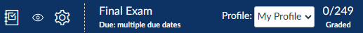
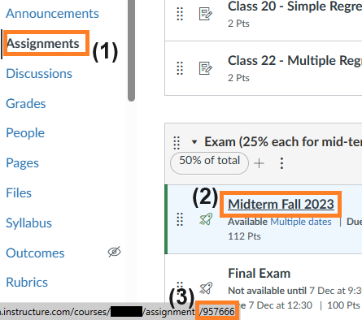
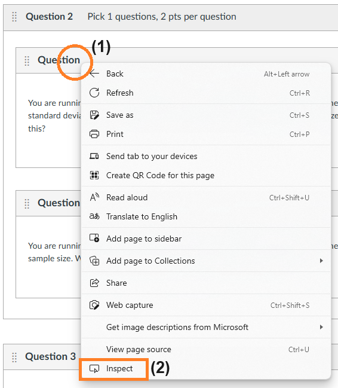
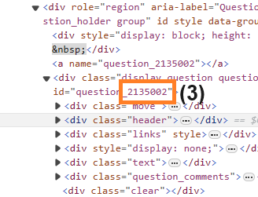
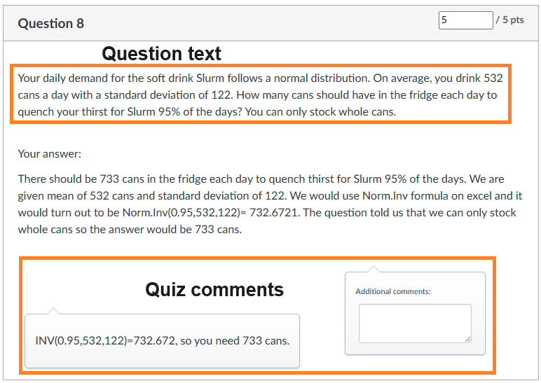

# SpeedGraderPlus.js

A JavaScript module to improve SpeedGrader on Canvas LMS.

Also contains CSS improvements under [css/](css/).

## Features

1. Hide specific questions you do not want to see while using SpeedGrader.

2. Hide question text and/or quiz comments.

3. Maintain different profiles on what to show or hide per assignment. Profiles can be switched between easily using a drop-down menu at the navigation bar.


## Installation

There are two ways to install SpeedGraderPlus:

1. Use a user JavaScript plugin on your browser, such as [User JavaScript and CSS](https://chrome.google.com/webstore/detail/user-javascript-and-css/nbhcbdghjpllgmfilhnhkllmkecfmpld) plugin for Chromium-based browsers, to execute the configuration and code whenever you visit Canvas LMS.

2. Enter the configuration and code directly into the [browser console](https://appuals.com/open-browser-console/).

## Configuration

SpeedGraderPlus.js is configured in the `sgpConfig` object at the start of the code:
```
let sgpConfig = {
	enabled: true,
	assignments: [
		{
			assignmentId: 0,
			profiles: [
				{
					name: "Profile",
					hideQuestions: true,
					questionIds: [
						0,
						"1",
						{id: 2, exists: 3, studentIdFn: "odd"},
						...
					],
					hideQuestionText: true,
					hideQuizComments: true
				},
				...
			]
		},
		...
	],
};
```

### Enable SpeedGraderPlus.js

Set `enabled` to `true` if you want to use SpeedGraderPlus.js; `false` otherwise.

### Assignments

`assignments` is an array of Assignment objects that allows for different settings for each Assignment.

```
assignments: [
	{
		assignmentId: 0,
		profiles: [ ... ]
	},
	...
],
```

#### Assignment ID

SpeedGraderPlus.js will only work on the specified Assignment ID under the `assignmentId` setting. You can find this by (1) going the Assignments section of Canvas LMS; (2) hovering over the desired Assignment; and (3) taking down the number that comes after `assignments/` in the URL.



> **NOTE:** This is not the same as the Quiz ID, and the Quiz ID should not be used.

#### Profiles

In each Assignment object, `profiles` is an array of Profile objects are groups of different settings for that Assignment.

```
profiles: [
	{
		name: "Profile",
		hideQuestions: true,
		questionIds: [ ... ],
		hideQuestionText: true,
		hideQuizComments: true
	},
	...
]
```

##### Profile Name

Set `name` to define the name that is shown on the Profile seletion drop-down.

##### Hide Questions

Set `hideQuestions` to `true` to hide all questions except those specified in `questionIds`; `false` otherwise.

##### Question IDs

`questionIds` is an array of Question IDs: numeric or string plain Question IDs and/or objects that specify the conditions that need to be met to show the Question.

```
questionIds: [
	0,
	"1",
	{id: 2, ... },
	...
]
```

A plain Question ID can be specified as a numeric or string value. You can find this by editing the Assignment or Quiz, and: (1) right-clicking on the header of the Question (note: if the question is part of a group, you have to right-click the question in the group and not the group); and (2) selecting "Inspect".



The Browser Console will appear with the "header" line selected. Then: (3) look nearby for the Question ID and take down the number.



A conditional Question ID object is configured as follows:

```
{
	id: 2,
	exists: 3,
	studentIdFn: "odd"
}
```

- `id` (required) - the Question ID.
- `exists` (optional) - the Question ID here must exist in the Assignment before the Question referred to by `id` will be shown. This is used when an earlier question has multiple versions, and the version shown affects the `id` Question.
- `studentIdFn` (optional) - students on Canvas are given a unique numerical identifier. This configuration allows for one of the in-built functions or a custom function to determine which Questions to show using the Student ID. It can take one of the following values:
	- `"odd"` - shows the Question if the Student ID is an odd number.
	- `"even"` - shows the Question if the Student ID is an even number.
	- `(studentId) => {...}` (custom function) - user-specified function that takes in the Student ID, and returns `true` if the question should be shown and `false` if not.

If no conditions are specified, the Question will be shown. If multiple conditions are specified, they all must be `true` for the Question to be shown.

##### Hide Question Text

Set `hideQuestionText` to `true` to hide the text of the question on all questions; `false` shows it.



##### Hide Quiz Comments

Set `hideQuizComments` to `true` to hide quiz comments; `false` shows them.

### Changing Configuration On-the-Fly

You can change the configuration by setting `sgp.config` with a new configuration object on the Browser Console, and then running the `sgp.reapply()` function to apply the changes.

## Versions

### v2.0.0 (2023-12-08)
- Added handling for multiple assignments.
- Added profiles for multiple configurations.
- Added logic for selecting which questions to show, including:
	- Check for the existence of another question.
	- Checks using student IDs.
- Increased robustness of code.

### v1.2.0 (2023-11-12)
- Added switch to hide questions.

### v1.1.0 (2023-10-19)
- Implemented hide question text and quiz comments.
- Moved configuration out of the application.
- Increased robustness of code.

### v1.0.0 (2023-10-19)
- First release.

## License

[MIT](/LICENSE)
